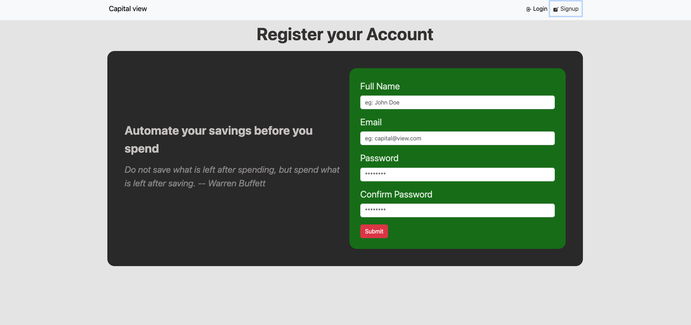
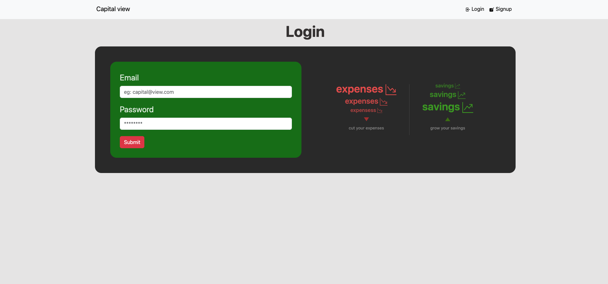
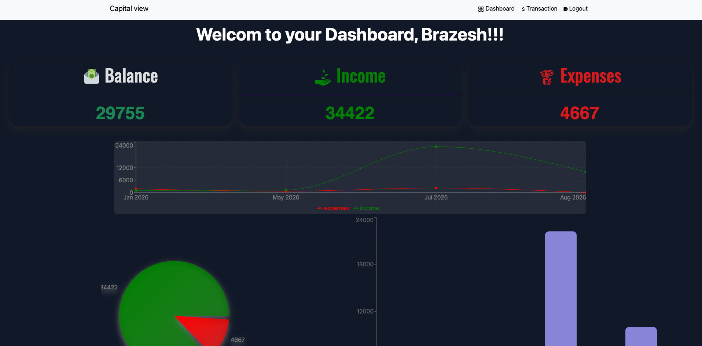
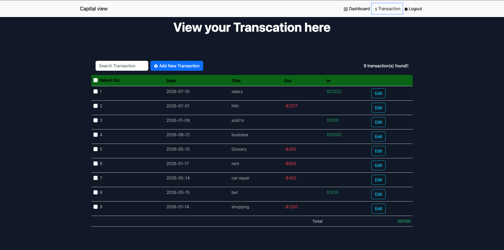

# Capital View

Capital View is a personal finance tracker that lets users sign up, log in, and keep track of their income and expenses. This repo contains the frontend client.

## Features

- User signup and login
- **Dashboard** (private, logged-in users only)
  - Total income, total expenses, and total balance at a glance
  - Bar chart, pie chart, and line chart of income/expense entries
  - Friendly empty state ("no transaction yet") when there's no data
- **Transactions** (private, logged-in users only)
  - Table of all transactions
  - Add a transaction via a modal (date, title, type, amount)
  - Search bar (controlled input) to filter the table by matching letters
  - Select one or more transactions to reveal a delete button
  - Edit any transaction — opens the same modal prefilled with its data
  - Empty state ("no transaction yet") when the table is empty
  -

## Live Demo

https://capital-view-frontend.vercel.app/

## Screenshots






## Tech Stack

- React
- Vite
- JavaScript
- Axios
- React Bootstrap
- Recharts (charts)

## Getting Started

### Prerequisites

- Node.js and Yarn installed
- The Capital View backend running (see its README for setup) — link: `https://github.com/bguragain1023-web/CapitalView-Backend`

### Installation

```bash
git clone https://github.com/bguragain1023-web/CapitalView-Frontend
cd CapitalView-Frontend
yarn install
```

### Environment Variables

Create a `.env` file in the project root:

```dotenv
VITE_ROOT_API=http://localhost:8000
```

### Running Locally

```bash
yarn dev
```

The app will be available at the local URL Vite prints in the terminal (typically `http://localhost:5173`).

## Project Structure

```
├── README.md
├── eslint.config.js
├── helper
│   └── axios.js
├── index.html
├── package.json
├── public
├── src
│   ├── App.css
│   ├── App.jsx
│   ├── assets
│   │   ├── dashboard.png
│   │   ├── login.png
│   │   ├── signUp.png
│   │   └── transaction.png
│   ├── components
│   │   ├── CustomBarDiagram.jsx
│   │   ├── CustomInput.jsx
│   │   ├── CustomLineGraph.jsx
│   │   ├── CustomModal.jsx
│   │   ├── CustomPieChart.jsx
│   │   ├── ExpensesSavings.jsx
│   │   ├── FinanceTips.jsx
│   │   ├── LoginForm.jsx
│   │   ├── SignUPForm.jsx
│   │   ├── TransactionForm.jsx
│   │   ├── TransactionTable.jsx
│   │   ├── auth
│   │   │   └── Auth.jsx
│   │   └── layout
│   │       ├── Footer.jsx
│   │       ├── Header.jsx
│   │       └── Layout.jsx
│   ├── contex
│   │   └── UserContex.jsx
│   ├── hooks
│   │   └── useForm.js
│   ├── index.css
│   ├── main.jsx
│   ├── pages
│   │   ├── Dashboard.jsx
│   │   ├── Login.jsx
│   │   ├── SignUp.jsx
│   │   └── Transaction.jsx
│   └── utils
│       └── users.js
├── vercel.json
├── vite.config.js
└── yarn.lock
```

## License

This project is licensed under the MIT License.

## Author

Brazesh Guragain:https://www.brazeshguragain.com

Linkedin: https://www.linkedin.com/in/brazesh-guragain-32a6661b0/

Github: https://github.com/bguragain1023-web
